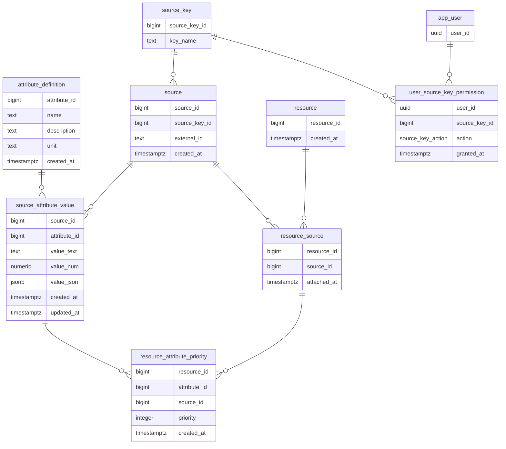

```mermaid
erDiagram
  app_user {
    uuid user_id
  }
  resource {
    bigint resource_id
    timestamptz created_at
  }
  source_key {
    bigint source_key_id
    text key_name
  }
  source {
    bigint source_id
    bigint source_key_id
    text external_id
    timestamptz created_at
  }
  source_key ||--o{ source : ""
  attribute_definition {
    bigint attribute_id
    text name
    text description
    text unit
    timestamptz created_at
  }
  resource_source {
    bigint resource_id
    bigint source_id
    timestamptz attached_at
  }
  resource ||--o{ resource_source : ""
  source ||--o{ resource_source : ""
  source_attribute_value {
    bigint source_id
    bigint attribute_id
    text value_text
    numeric value_num
    jsonb value_json
    timestamptz created_at
    timestamptz updated_at
  }
  source ||--o{ source_attribute_value : ""
  attribute_definition ||--o{ source_attribute_value : ""
  resource_attribute_priority {
    bigint resource_id
    bigint attribute_id
    bigint source_id
    integer priority
    timestamptz created_at
  }
  resource_source ||--o{ resource_attribute_priority : ""
  source_attribute_value ||--o{ resource_attribute_priority : ""
  user_source_key_permission {
    uuid user_id
    bigint source_key_id
    source_key_action action
    timestamptz granted_at
  }
  app_user ||--o{ user_source_key_permission : ""
  source_key ||--o{ user_source_key_permission : ""
```
