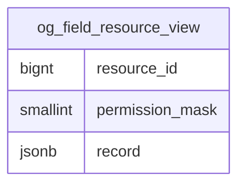
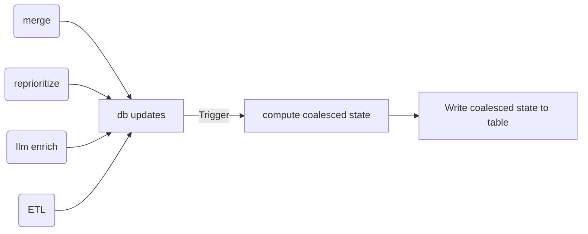
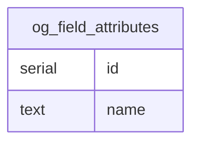
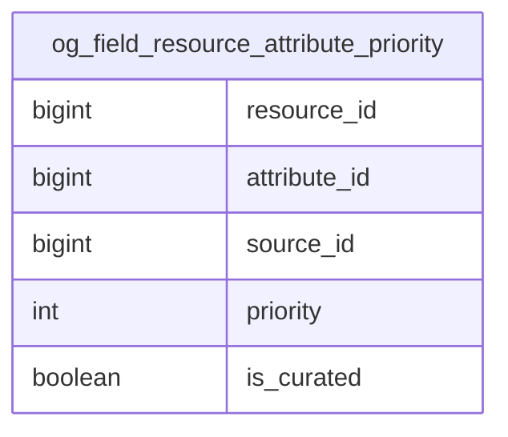
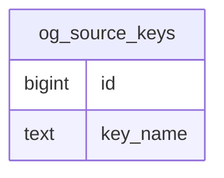
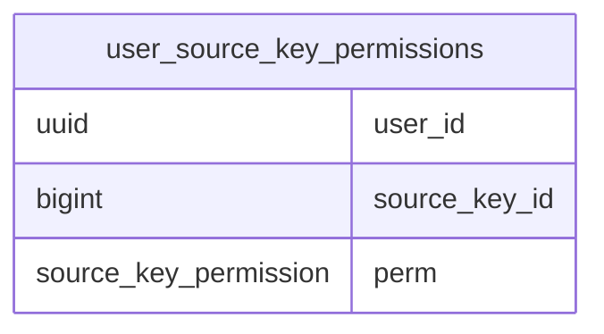

# STIT-766 — Current-state read model: design proposal

**Status:** draft
**Author:** Michael Barlow
**Reviewer:** John McGrath
**Jira:** [STIT-766](https://rmi1.atlassian.net/browse/STIT-766) (epic [STIT-689](https://rmi1.atlassian.net/browse/STIT-689))
**Created**: 2026-09-17

## 1. Objective

Design a database architecture and application logic to serve the key Stitch endpoints with minimal latency.

## 2. Background

### Problem

The `list`, `filter-options`, and `detail` endpoints all rebuild the same thing on every request: one coalesced, flat row per resource that represents the current top-level "state". `queries.py` does this by joining membership → resource → default priority → source → value rows, left-joining per-field overrides, ranking candidates with a four-key `ROW_NUMBER()` window, and then pivoting the winners into columns with `max(case(...))` per field.

Combined with serializing to/from Pydantic models, this has led to poor response times that
negatively impact user experience. Furthermore, given that our entire db is less than 100MB
in size, this raises questions about our overall db design and access patterns.

### Observations

With the newly added attribute-level priority feature ([STIT-494](https://rmi1.atlassian.net/browse/STIT-494)), we now have a more deterministic and bounded way to establish the different variations we display for a flat resource. Our permissions model only has 2 restricted options: `wm` and `cc`. All the remaining sources are public, and ALL users have read permissions for them.

> [!NOTE]
> It was more straightforward to treat these individually when implemented, but reviewing our permissions model may help simplify in the future. However, it's not strictly necessary for this work.

If we think of the set of `llm`, `rmi`, `bc`, `alb`, and `gem` as a single `public` visibility.
Then there are some fairly significant implications in how our coalescing logic actually
plays out. For any given attribute on a coalesced resource, users will see at most 3
possible options: `wm`, `cc`, and the highest priority `public` source. To illustrate,
see the following scenarios for a resource's `latitude` data:

- priorities: `wm`, `cc`, `gem`, `bc`
  - user with `wm + cc` sees `wm`
  - user with `wm` sees `wm`
  - user with `cc` sees `cc`
  - remaining users see `gem`
- priorities: `wm`, `cc`, `gem`, `rmi`, `llm`, `alb`
  - user with `wm + cc` sees `wm`
  - user with `wm` sees `wm`
  - user with `cc` sees `cc`
  - remaining users see `gem`
- priorities: `cc`, `gem`, `wm`, `bc`
  - user with `wm + cc` sees `cc`
  - user with `cc` sees `cc`
  - all remaining users (including `wm` viewers) see `gem`
- priorities: `bc`, `cc`, `wm`, `gem`
  - all users see `bc`
- priorities: `bc`, `gem`, `cc`, `wm`
  - all users see `bc`

For any view or operation that interacts only with the flattened representation of a resource:

- we only need to store/cache up to the first public source in the priority list
- a resource attribute has at most 3 variations: `wm`, `cc`, and `public`
- an entire coalesced resource has **at most 4 possible variations** depending on user permissions and attribute priorities:
  - `public`: all attributes have a public source as the highest priority
  - `public + wm`: 1 or more attributes has `wm` as highest priority and all next-highest priorities are public
    - said another way, all top 2 priorities are either `wm` or `public` and at least 1 is `wm`
  - `public + cc`: 1 or more attributes has `cc` as highest priority and all next-highest priorities are public
    - all top 2 priorities are either `cc` or `public` and at least 1 is `cc`
  - `public + wm + cc`: at least 1 attribute where `wm` is highest **AND** 1 attribute where `cc` is highest
    - Note: `wm + cc` must see different data from both `wm` and `cc` individually

Thus, whatever structure we use here is bounded by at most 4 x the number of top-level (unmerged) resources: 1 variant for each possible licensed representation.

> [!NOTE]
> One caveat here is that the number of possible variants grows exponentially with the number of distinct licenses:
>
> - 2 licensed sources = 4 variants
> - 3 licensed sources = 8 variants
> - 4 licensed sources = 16 variants
>
> so even if we add 2 proprietary sources, this structure grows to a max of 16 x the number of top-level (unmerged) resources. I don't see this as a real issue even in the long term. How many licensed sources are even realistic? 6? 10? Even at 10 proprietary sources, the view/table would be 2^10 = 1024 x resources. The upper bound of **all** named fields is probably somewhere in the ~65k range, so ~65M rows is still manageable...if we'd ever even get close to that.

## 3. Goals and non-goals

**Goals**

1. Serve `list` and `filter-options` with <100ms latency
2. Give the database one unambiguous stored answer to "what is the value for each attribute of a resource for a user with X permissions"
3. As a follow-up to 2, provide one unambiguous stored representation for each resource for each effective user permission set.
4. Express the invariants declaratively in schema, so the sync/refresh mechanism has lower/zero risk regarding correctness
5. Preserve the public REST surface and today's behavior

**Non-goals**

- A general permission-based solution that accounts for all future/unknown licensed and public permissions
- The details of the sync mechanism. See §6.
- Redesigning the permission model.

## 4. Schema Changes

Part of the goal is to trade application complexity for schema complexity. Making schemas more complex but in a way that enables tighter constraints and simpler queries (i.e. through mostly joins) frees our application code from being the enforcer of invariants.

### Resource State View/Table

The purpose is to provide a durable store that houses the flattened/coalesced resources. We're effectively precomputing the coalescing logic and saving it to a single table. The actual schema is less important than its function and the constraints we place on it.

It must:

- only store unmerged resources (i.e. where `repointed_id == NULL`), merging triggers deletion from the table
- provide highly performant, permission-scoped querying of resource data
- not expose proprietary information to unlicensed users
- provide resource representations that are consistent with existing coalescing logic
- be able to be rebuilt from scratch at any time, we should be able to derive the data for the table easily & quickly

The top contender for a schema is:



**permission mask**
The `permission_mask` is a bitmask where `public` = 0, `cc` = 1, `wm` = 2, and `wm + cc` = 3.

| wm  | cc  | perm |
| --- | --- | ---- |
| 0   | 0   | 0    |
| 0   | 1   | 1    |
| 1   | 0   | 2    |
| 1   | 1   | 3    |

This allows for 2 filtering options:

- strict `permission_mask = <user permission>` (incurs minor cost of possibly duplicating data across rows)
- bit comparison to filter where `(<user permission> | permission_mask) = <user permission>`
  - if we sort by `permission_mask` (desc), this would allow us to only store the minimum number of resource variants
    - for example, if a resource had ALL public sources as the highest priorities, we'd only need 1 row in the table with `permission_mask = 0` because ALL users would see the same version
    - or if a resource had only `wm` and `public` variants, a `wm + cc` permission would get the `wm` version: 3 (`cc + wm`) | 2 (`wm`) = 3
    - but a `cc` permission would skip the `wm` row and see the `public` variant:
      1 (`cc`) | 2 (`wm`) = 3 => exclude
      1 (`cc`) | 0 (`pub`) = 1 => include

> [!NOTE] Permission Alternative
> We can also use permission columns for the minor cost of duplicating data across columns. Benefits from being a simpler more understandable approach.

**record column as jsonb**
We'd effectively house the entire flat Pydantic model in json. The main reasoning is that we can likely expand to near-instant full-text search without much difficulty. It's also partially as an experiment to assess the difficulty of working with Postgres JSON syntax and investigate whether there are performance trade-offs. Should it prove easy to use while still being performant, it opens the door to using it in other places across our application where we might want greater flexibility in our data handling.

**sync overview**
Very roughly speaking, when a user or process updates relevant data (merge resources, reprioritize, new sources from ETL), we compute the updated view state(s), and write them to the table, deleting where necessary.



### Attribute metadata: `og_field_attributes`



Priority rows and EAV rows reference `og_field_attribute.id`

### Single priority store: `og_field_resource_attribute_priority`

Replace the two-table priority split with a single table at the
`(resource, attribute, source record)` grain, and use defaults when
writing new data rather than as a SQL fallback rule.



- Drop `og_field_source_priority` and `og_field_resource_source_priority`.
- On resource or source creation, write explicit priority rows for every attribute
  the source has a value for, seeded from the existing `SOURCE_PRIORITY` tuple in
  `stitch.ogsi.model`.
- Add constraints:
  - unique priority across resource and attribute: no 2 rows for a resource & attribute can have the same priority
    `UNIQUE (resource_id, attribute_id, priority)`
  - priority > 0
  - fk constraint to memberships on resource_id, source_id: ensure source is attached to resource
  - fk constraint to `og_field_source_values` on `source_id, attribute_id`
- `oil_gas_field_source_values` currently has an `id` primary key, so we could replace `(attribute_id, source_id)` with `source_value_id`
- we set `is_curated` to `True` when a user makes an update

### Optional Additional Tables

These are primarily for some convenience in constructing simpler SQL statements and permissions handling.



References to `source` or `src_key` become foreign keys with `source_key_id`.



Where the `source_key_permission` is a new ENUM type with `read`, `edit`.

What this would allow is comparatively smaller and more straightforward SQL statements.

**single resource for a user**

```sql
WITH resolved AS (
    SELECT DISTINCT ON (
        p.resource_id,
        p.attribute_id
    )
        p.resource_id,
        p.attribute_id,
        p.source_id,
        s.source_key_id,
        p.priority,
        v.value_text,
        v.value_num,
        v.value_json
    FROM og_field_resource_attribute_priority AS p
    JOIN oil_gas_field_source_values AS v
      ON v.source_id = p.source_id
     AND v.attribute_id = p.attribute_id
    JOIN oil_gas_field_sources AS s
      ON s.source_id = p.source_id
    JOIN user_source_key_permission AS permission
      ON permission.source_key_id = s.source_key_id
     AND permission.user_id = $1     -- pass in specific user id
     AND permission.action = 'read'
    WHERE p.resource_id = $2         -- drop this predicate to fetch many resources
    ORDER BY
        p.resource_id,
        p.attribute_id,
        p.priority
        -- p.source_id  <-- unnecessary with the priority uniqueness constraint
)
SELECT
    r.resource_id,
    jsonb_object_agg(
        a.name,
        COALESCE(
            to_jsonb(r.value_text),
            to_jsonb(r.value_num),
            r.value_json
        )
    ) AS attributes
FROM resolved AS r
JOIN og_field_attributes AS a
  ON a.attribute_id = r.attribute_id
GROUP BY r.resource_id;

```

Note: The above can be paged and totaled as well with minimal alteration.

**single resource detailed provenance**

```sql
SELECT
    p.resource_id,
    a.name AS attribute,
    p.source_id,
    sk.key_name AS source_key,
    p.priority,
    v.value_text,
    v.value_num,
    v.value_json
FROM og_field_resource_attribute_priority AS p
JOIN oil_gas_field_source_values AS v
  ON v.source_id = p.source_id
 AND v.attribute_id = p.attribute_id
JOIN og_field_attributes AS a
  ON a.attribute_id = p.attribute_id
JOIN og_field_sources AS s
  ON s.source_id = p.source_id
JOIN og_source_keys AS sk
  ON sk.source_key_id = s.source_key_id
JOIN user_source_key_permission AS permission
  ON permission.source_key_id = s.source_key_id
 AND permission.user_id = $1
 AND permission.action = 'view'
WHERE p.resource_id = $2
ORDER BY p.priority, p.source_id;
```

## 5. Open Issues

1. Priority row count at current and projected resource volume.
2. How to handle priorities upon merge?
